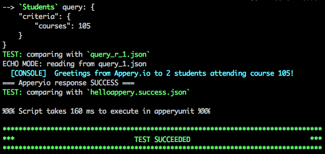
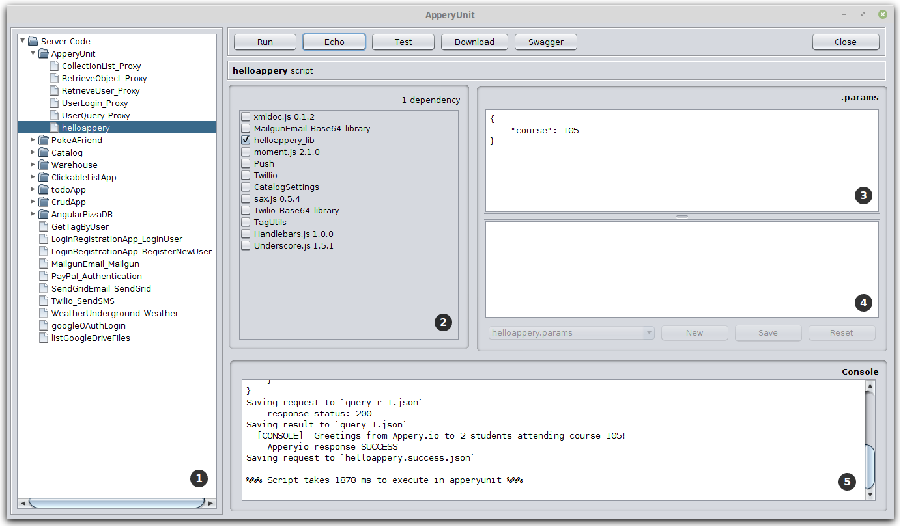

= ApperyUnit
:icons: font
:source-highlighter: coderay
:toc: macro
:apperyref: https://docs.appery.io/reference
:description: Use it to unit-test Appery.io server code functions.

Use it to unit-test link:https://appery.io[Appery.io] server code functions.

Download::
  icon:download[] {nbsp} link:distr/apperyunit-0.99.zip?dl=0[apperyunit-0.99.zip] {nbsp}(7.5M)

Source::
  icon:github[] {nbsp} https://github.com/a-services/apperyunit

toc::[]


== Features

link:https://java.com/ru/download/[Java] has to be available on the system to run link:https://apperyunit.app.appery.io[ApperyUnit].

You can run it from shell scripts or just double-click `apperyunit.jar` file from the distribution.

Appery Server Code API is supported for read functions.
Functions of `Collection` that change data in Appery DB will just print request parameters to console.
More details can be found at <<supported-apis>> section.

Shell script `au.sh` provided to demonstrate the usage of ApperyUnit.
Use this script to run `helloappery.js` server code function:
```
  ./au.sh r
```

To run the test in echo mode add `e` parameter:
```
  ./au.sh e
```

To test the fixtures add `t` parameter:
```
  ./au.sh t
```



Running without parameters starts application in GUI mode:

```
  ./au.sh
```

Or you can just double-click `apperyunit.jar` from the distribution to open GUI.



NOTE: Clicking **Download** button for the root node allows to download all scripts from the account.

== Usage scenarios


=== Creating new scripts

ApperyUnit can be used to create new Appery.io server code scripts. Let's suppose we have to implement some new functionality that can probably update the DB in some way. For example, we may need to delete some entity from the database afer some preliminary checks. Or maybe our service should change system status in some way. If we'll create some initial version of the script and then run it in Appery, then there is a good chance that some part of the script will be executed and the other one not due to some error. After we'll do some fix and run our code again, we can find out that the database entity that we are using for testing was changed, or necessary system status has gone.

With ApperyUnit we have the convenience to save database read requests but actually do not run them. It allows to modify and run our code till we get some acceptable results. We can also inspect JSON data received from the database. We can even edit JSON files coming from database to achieve the required level of test coverage.

The ability to run the code is particularly important for dynamic programming language like JavaScript that we are using for our server code scripts, when missing `var` operator for the variable declaration or some forgotten dependency checkbox in Appery can lead to run-time errors but are not diagnosed by the tools.

When our server code will be properly tested, we can copy it into Appery.io editor.
With that approach database query results are saved locally. We can consider them to be the input data for our server code. Query parameters of database update requests can be treated as the expected results of our server code.

=== Refactoring the existing scripts

With ApperyUnit we can load the existing versions of the scripts from Appery.io.
We have already saved query parameters of database update requests on the previous step, so with the tests we can ensure that script outputs were not changed and our refactorings didn't break anything.

== Dependencies

Dependencies between the scripts can be specified in `dependencies.json` file.

Example:

====
```json
{
  "my_script_1": <1>
     ["my_library_2", "my_library_3"],
  "my_library_2": <2>
     ["my_library_4"]
```
====

<1> Script named `my_script_1` depends on 2 libraries
<2> Libraries can have their own dependencies

== Echo mode

The result of each read request to Appery DB is saved in `fixtures` folder in files named `query_1.json`, `query_2.json`...

When `echo` parameter is specified, then no real requests to Appery DB will be made, but the contents of `query_1.json`, `query_2.json`...  files will be returned in proper order.

== Test mode

Parameters of each *read* request to Appery DB are saved to files named like `query_r_1.json`, `query_r_2.json`...

Similar, parameters of each *write* request are saved to `update_r_1.json`, `update_r_2.json`...

The result of server code execution is saved to `script_name.success.json` file.

We assume that our server code script is going to perform the same read and write requests to Appery DB after the refactoring.

It should be mentioned that write requests to Appery DB are not actually executed by ApperyUnit, so database remains unchanged after the test and we can run it once again with the same results.

When ApperyUnit is started in `test` mode, then read requests to Appery DB are replaced with echoes, and the contents of read and write request parameters
are compared with the saved contents of `query_r_#.json`, `update_r_#.json` and `script_name.success.json` files.


== Command-line parameters

To try something else rather then simple `helloappery` script you can create some empty folder
and copy 'au.sh' there. Then you should adjust the path to `apperyunit.jar` in this new copy of `au.sh` to point to the
folder where you placed the distribution of ApperyUnit.

You can pass the following parameters to `$AU` utility in `au.sh` file:

script_name.js::
    This is the name of local file with server code. +
    Required if we are not in downloading mode.

script_name.params::
    Parameters of server code function can be specified in <<params>> as JSON

echo::
    Run script in echo mode - do not perform real `HTTP GET` requests but use
    `query-NN.json` files from `fixtures` folder.

test::
    Run script in test mode - do not perform real `HTTP GET` requests,
    compare `HTTP POST` requests with
    `update-NN.json` files in `fixtures` folder.


[[params]]
=== `.params` file

- Parameters of server code function can be specified in `.params` file as JSON

- Request headers can be also specified in this JSON as a special `headers` field.

- Request body can be also specified,
  it should be separated from JSON with a line of 4 dashes, like this: `----`.

Example:

====
```json
{
	"param1": "value1", <!--1-->
	"param2": "value2",
	"param3": "value3",

	"headers": { <!--2-->
		"X-Appery-Session-Token": [ "582345afe4b08d1f18d1479b" ]
	},

	"user": { <!--3-->
	    "_id": "582345afe4b08d1f18d14799"
	}

}
----
{ "password":"22" } <!--4-->
```
====

<1> Parameters of server code function
<2> Request headers
<3> When server code function is secured, than it has `user` parameter in request
<4> Request body string


[[paramlist]]
=== `.paramlist` file

Each new test scenario requires its own parameters, so we need a set
of `.params` files associated with the single server code script.
This can be specified with `.paramlist` file.

Each line in `.paramlist` is a name of `.params` file,
or it can be empty, or commented out with `#` character.


[[supported-apis]]
== Supported Server Code Functions

ApperyUnit is intended to be used to unit-test Appery Server Code functions.
To be able to run tests multiple times the functions of `Collection` object that change data in Appery DB will just print request parameters to console but not actually change anything in DB.

Also, some link:{apperyref}[Appery Server Code APIs] are not yet supported by ApperyUnit.
Current status can be found at the table below.

=== Console

[cols="m,a"]
|===
| link:{apperyref}#servercode-console-log[log()]  | icon:check[] supported
| link:{apperyref}#servercode-console-time[time()] | icon:times[] not supported yet
| link:{apperyref}#servercode-console-dir[dir()] | icon:times[] not supported yet
| link:{apperyref}#servercode-console-assert[assert()] | icon:times[] not supported yet
| link:{apperyref}#servercode-console-timeend[timeEnd()] | icon:times[] not supported yet
| link:{apperyref}#servercode-console-trace[trace()] | icon:times[] not supported yet
|===

=== Collection

[cols="m,a"]
|===
| link:{apperyref}#servercode-collection-deleteobject[deleteObject()] | icon:hand-o-right[] print request parameters to console
| link:{apperyref}#servercode-collection-multiupdateobject[multiUpdateObject()] | icon:hand-o-right[] print request parameters to console
| link:{apperyref}#servercode-collection-getcollectionlist[getCollectionList()] | icon:check[] supported
| link:{apperyref}#servercode-collection-distinct[distinct()] | icon:check[] supported
| link:{apperyref}#servercode-collection-multideleteobject[multiDeleteObject()] | icon:hand-o-right[] print request parameters to console
| link:{apperyref}#servercode-collection-updateobject[updateObject()] | icon:hand-o-right[] print request parameters to console
| link:{apperyref}#servercode-collection-query[query()] | icon:check[] supported
| link:{apperyref}#servercode-collection-createobject[createObject()] | icon:hand-o-right[] print request parameters to console
| link:{apperyref}#servercode-collection-retrieveobject[retrieveObject()] | icon:check[] supported
|===

=== DatabaseUser

[cols="m,a"]
|===
| link:{apperyref}#servercode-databaseuser-logout[logout()] | icon:times[] not supported yet
| link:{apperyref}#servercode-databaseuser-update[update()] | icon:hand-o-right[] print request parameters to console
| link:{apperyref}#servercode-databaseuser-retrieve[retrieve()] | icon:check[] supported
| link:{apperyref}#servercode-databaseuser-signup[signUp()] | icon:hand-o-right[] print request parameters to console
| link:{apperyref}#servercode-databaseuser-login[login()] | icon:check[] supported
| link:{apperyref}#servercode-databaseuser-query[query()] | icon:check[] supported
| link:{apperyref}#servercode-databaseuser-remove[remove()] | icon:times[] not supported yet
|===

=== Push Notifications

[cols="m,a"]
|===
| link:{apperyref}#servercode-push-notifications-send[send()] | icon:hand-o-right[] print request parameters to console
| link:{apperyref}#servercode-push-notifications-listscheduled[listScheduled()] | icon:times[] not supported yet
| link:{apperyref}#servercode-push-notifications-deletescheduled[deleteScheduled()] | icon:times[] not supported yet
|===

=== XHR

[cols="m,a"]
|===
| link:{apperyref}#servercode-xhr-send[send('GET')] | icon:check[] supported
| link:{apperyref}#servercode-xhr-send[send('POST')] | icon:hand-o-right[] print request parameters to console
|===

++++
<!--script src="button-download.js"></script-->
++++

////
== More Appery.io tools

More Appery.io tools can be found link:http://apperyunit.app.appery.io/more.html[here].

See also::
  link:logblock.html[logblock] - Appery.io plug-in to send logs to `<div>` component on the page.
////
